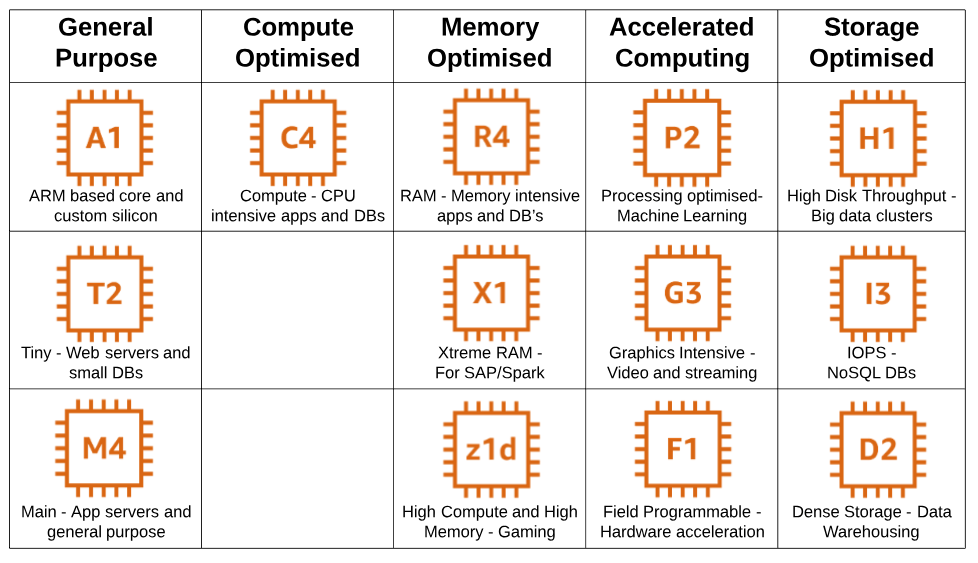

# Amazon Elastic Compute Cloud (EC2)

## 1. What is EC2?
  - EC2 - Elastic Compute Cloud: là một nền tảng(dịch vụ) cung cấp máy chủ ảo(Cloud Computing) trên hệ thống AWS
  - Có thể tuỳ chọn cấu hình máy ảo: OS, memory, CPU, GPU, Network, storage, Security...
  - Dễ dàng triển khai
  - Dễ dàng scale phù hợp với sử dụng hay business
  - Tiết kiệm chi phí
## 2. Phân loại EC2
  ### 2.1. Phân loại theo nhu cầu sử dụng(family type)
  
  #### a. General Purpose
  - Cân bằng giữa compute, memory và networking resources
  - Sử dụng cho nhiều loại mục đích
  - Thường dùng cho các ứng dụng web, api hay lưu trữ source
  - Family type name: Mac, T4g, T3, T3a, T2, M6g, M6i, M5, M5a, M5n, M5zn, M4, A1
  #### b. Compute Optimized
  - Dùng cho các xử lý nặng cần CPU
  - Sử dụng cho các ứng dụng: media transcoding, high performance web servers, high performance computing, scientific modeling, dedicated gaming servers and ad server engines, machine learning inference and other compute intensive applications.
  - Famlity type name: C6g, C6gn, C5, C5a, C5n, C4
  #### c. Memory Optimized
  - Dùng cho các xử lý đỏi hỏi cao về memmory(RAM)
  - Thường dùng cho các ứng dụng: open-source databases, in-memory caches, and real time big data analytics
  - Family type name: R6g, R5, R5a, R5b, R5n, R4, X2gd, X1e, X1, High Memory, z1d
  #### d. Accelerated Computing
  - Dùng cho các xử lý cần tới GPU
  - Thường dùng cho các ứng dụng: Machine learning, high performance computing, computational fluid dynamics, computational finance, seismic analysis, speech recognition, autonomous vehicles, and drug discovery.
  - Family type name: P2, P3, P4, Inf1, G4dn, G4ad, G3, F1
  #### e. Storage Optimized 
  - Dùng cho các xử lý đòi hỏi tốc độ đọc/ghi dữ liệu lớn
  - Thường dùng cho các ứng dụng: NoSQL databases (e.g. Cassandra, MongoDB, Redis), in-memory databases (e.g. Aerospike), scale-out transactional databases, data warehousing, Elasticsearch, analytics workloads.
  - Family type name: I3, I3en, D2, D3, D3en, H1
  ### 2.2. Phân loại theo chi phí(cost plan)
  
  #### a. On-Demand
  - Chi phí tính theo sử dụng, không cần trả trước, không cần cam kết, dùng bao nhiêu trả bấy nhiêu, tính theo giờ hoặc giây sử dụng
  - Ưu điểm: Tuỳ chọn giá cả linh động, không cần thanh toán trước, phù hợp với các xử lý không thể tính toán được resources 
  - Nhược điểm: đắt đỏ và khó kiểm soát được phí sử dụng
  - Thường sử dụng cho các ứng dụng không thể xác định trước mức độ sử dụng, yêu cầu xử lý liên tục không gián đoạn, trong short-term
  #### b. Spot
  - Là một hình thức đấu giá available resource của AWS. Bạn có thể sử dụng instance cấu hình cao nhưng với chi phí chỉ bằng 90% On-Demand. Tuy nhiên, instance của bạn có thể bị thu hồi nếu có người bid giá cao hơn. Và AWS cũng cung cấp cơ chế Hybernate để lưu trữ cho trường hợp này và bạn sẽ nhận được thống báo thu hồi trước 2 phút.
  - Ưu điểm: có thể sử dụng cấu hình cao với chi phí thấp
  - Nhược điểm: Phải đấu giá với nhiều người, instance có thể bị thu hồi bất cứ lúc nào, đòi hỏi có cơ chế quản lý đặc biệt trong trường hợp bị thu hồi
  - Nếu instance bị thu hồi bơi AWS, không cần phải trả phí sử dụng. Nhưng nếu bạn là người kết thúc, bạn vẫn phải trả phí sử dụng.
  #### c. Reserved
  
  - Reserved Instances(RIs) là một hình thức đặt chỗ trước với cam kết sử dụng từ 1-3 năm để được mức giá rẻ hơn. Ngoài ra, có thể tuỳ chọn hình thức thánh toán để có mức phí rẻ hơn: No Upfront, Partial Upfront và All Upfront Về cơ bản có 3 hình thức Reserved:
    + Standard RIs: Là loại fixed cấu hình và tiết kiệm tới 72% so với On-Demand.
    + Convertible RIs: Có thể thay đổi cấu hình và tiết kiêm tới 54% so với On-Demand.
    + Scheduled: Là loại đặt trước với thời gian xác định.
  - Ưu điểm: Chi phí thấp, dễ control hơn so với Spot
  - Nhược điểm: Quản lý khó khăn hơn so với On-Demand, phải trả phí cả khi không sử dụng, không tôi ưu được hệ thống do fixed cấu hình.
  #### d. Saving
  - Là hình thức cam kêt sử dụng lâu dài từ 1-3 năm trong hạn mức đăng ký trước. Cần tạo 1 Saving Plan trước khi sử dụng. Ví dụ: cam kết chi phí sử dụng tối đa là 10$/hour trong 1-3 năm. Có 2 loại Saving:
    + EC2: Tiết kiệm tới 72%. Với hình thức này, instance bị fixed trong 1 Region và 1 Family Type. Tuy nhiên, bạn vẫn có thể thay đổi OS, AZ hay nâng cấu hình instance miễn là nó cùng Family. Ví dụ: c5.xlarge Windows sang c5.2xlarge Linux từ AZ-1 sang AZ-2 trong Region A.
    + Compute: Tiết kiệm tới 66% chí phí. Tuy nhiên, nó linh động hơn EC2. Có thể dễ dàng chuyển đỗi giữa các Region, AZ, Family type, Size thậm chí Service type như EC2 qua Fargate hay Lambda
  - Ưu điểm: Linh động, đơn giản, rẻ
  - Nhược điểm: Sử dụng hạn chế và phải chi trả 1 chi phí cố định.

  
  ### 2.3 Phân loại theo hình thức triển khai(shared - isolation)
  
  #### a. Share
  - Là các instance được setup trên cùng 1 máy chủ vật lý
  - Nhiều khách hàng chia sẽ với nhau tài nguyên và có thể gây ảnh hưởng đến nhau hay còn gọi là hiện tượng "noisy neighbor"
  - Có thể là Spot, Reserved...
  #### b. isolation
  
  - Có thể là Dedicated Instance hoặc Dedicated Host(nằm trên 1 server vật lý độc lập)
  - Phục vụ cho 1 khách hàng duy nhất. Dedicated Instance có thể share tài nguyên với những instances khác của cùng 1 AWS account.
  - Dedicated Instance On-Demand có thể tiết kiệm tới 90% so với Reserved và 70% so với Spot
  - Đối với Dedicated Host, khách hàng có thể sử dụng software licenses của mình để tiết kiệm chi phí hay đảm bảo các compliance đặc thù. Và hoàn toàn control server như On-Premise như có thể tạo bao nhiêu instance(máy ảo) tuỳ ý và handle chúng.
  

## 3. Tổng kết

Về cơ bản, EC2 được chia làm 4 model, chi tiết các model đã được đề cập phía trên
  - On-Demand
  - Reserved Isntances(RI)
  - Spot
  - Dedicated - Dedicated Hosting

## 4. Tham khảo
- [AWS Certified Cloud Practitioner Training](https://www.youtube.com/watch?v=3hLmDS179YE&t=11s "AWS Certified Cloud Practitioner Training").
- [AWS Certified Cloud Practitioner](https://d1.awsstatic.com/training-and-certification/docs-cloud-practitioner/AWS-Certified-Cloud-Practitioner_Exam-Guide.pdf "(CLF-C01) Exam Guide").
- [AWS Pricing in 2020: Overview, Principles and Examples [EC2, S3, Lambda]](https://rnd-solutions.net/2020/01/17/aws-pricing-in-2020-overview-principles-and-examples/ "AWS Pricing in 2020: Overview, Principles and Examples [EC2, S3, Lambda]").
- [Dedicated, On-Demand, Reserved and Spot— Demystifying the Terminology of AWS Instances](https://www.virtana.com/blog/demystifying-terminology-aws-instances/  "Dedicated, On-Demand, Reserved and Spot— Demystifying the Terminology of AWS Instances").
- [Amazon EC2 Instance Types](https://aws.amazon.com/ec2/instance-types/  "Amazon EC2 Instance Types").
- [Amazon EC2 Reserved Instances](https://aws.amazon.com/ec2/pricing/reserved-instances/?nc1=h_ls  "Amazon EC2 Reserved Instances").
- [Amazon EC2 Dedicated Instances](https://aws.amazon.com/ec2/pricing/dedicated-instances/  "Amazon EC2 Dedicated Instances").
- [Amazon EC2 Dedicated Hosts](https://aws.amazon.com/ec2/dedicated-hosts/ "Amazon EC2 Dedicated Hosts").