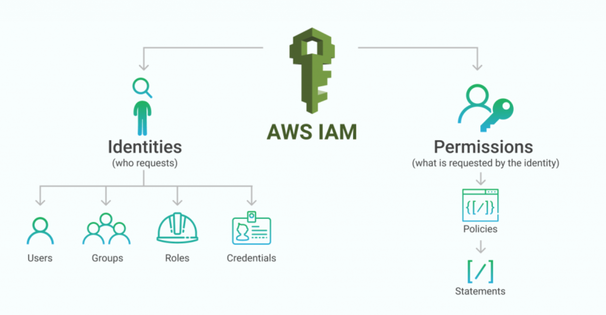
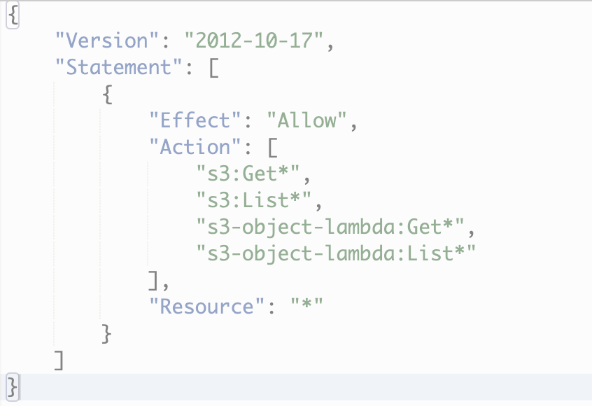
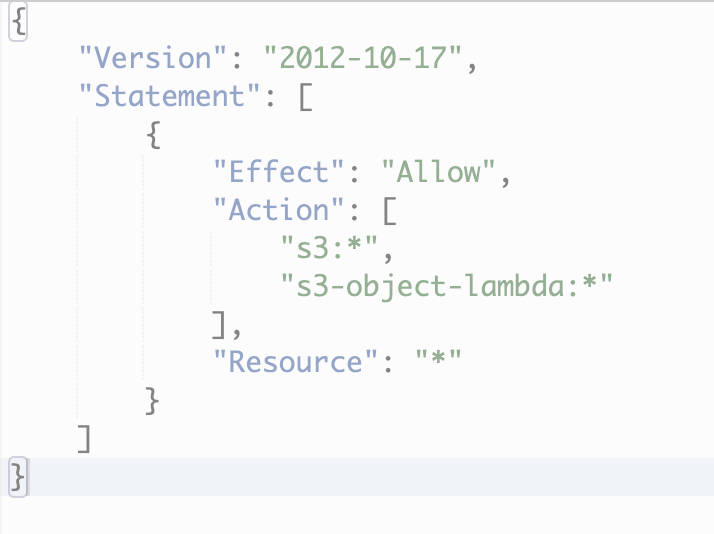
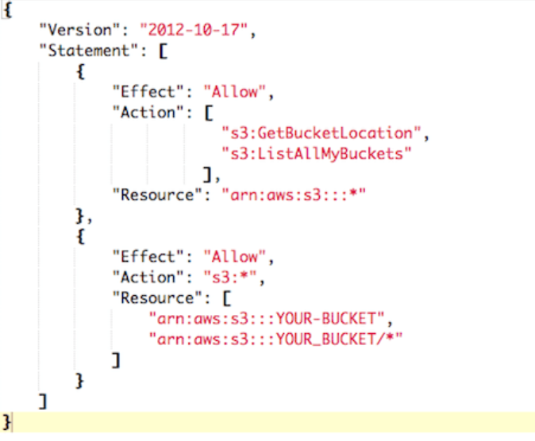
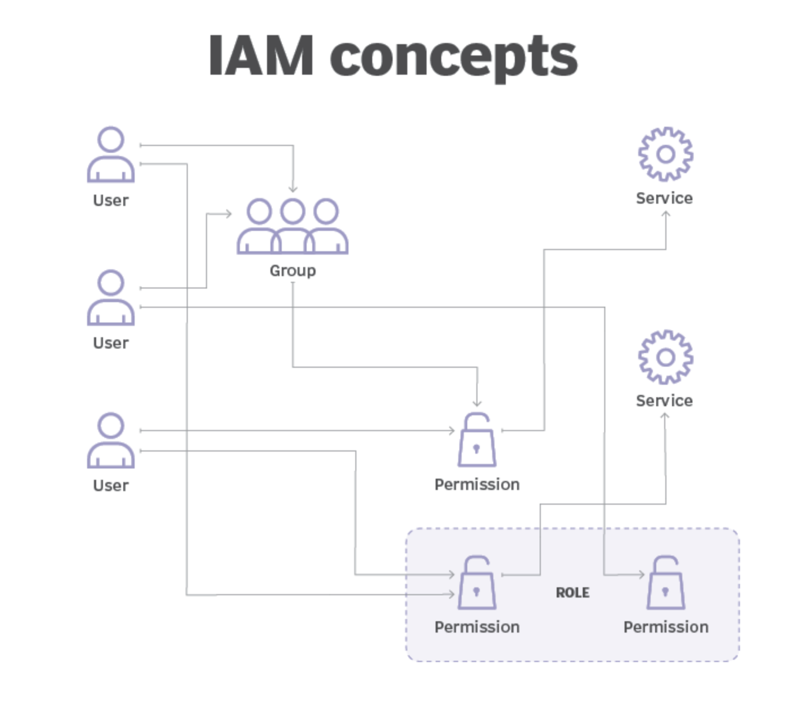
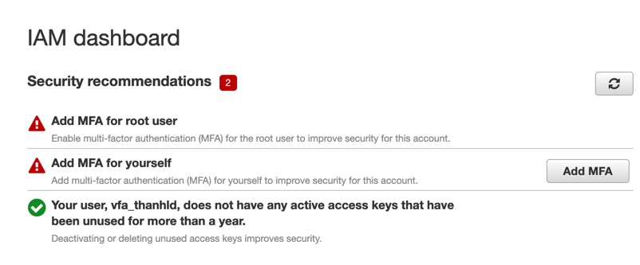
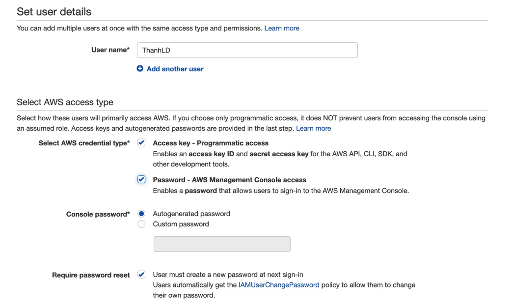
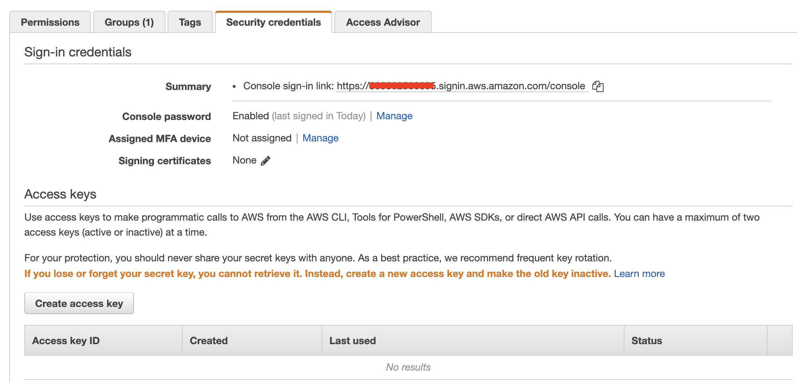
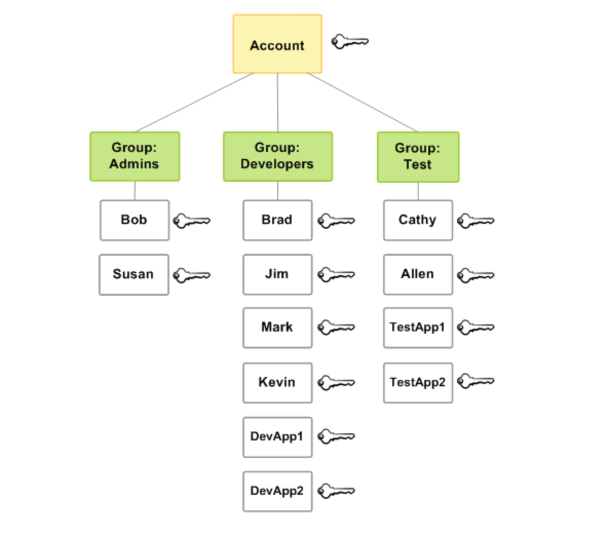

# AWS IAM

## 1. IAM là gì ?
 Identity and Access Management - IAM là một service giúp định danh và quản lý quyền truy cập các tài nguyên trên AWS. Tuy AWS gọi IAM là service nhưng mình thích gọi nó là "Tính năng" hơn để phân biệt service - có trả phí và tính năng - không trả phí. Vậy, IAM định danh và quản lý quyền truy cập như thế nào? Đó chính là: User, Group, Policy và Role.
 

## 2. Policy
  Hiểu đơn giản, Policy là 1 danh sách các thao tác được pháp mà bạn có thể thực hiện đối với 1 AWS Service nào đó hoặc 1 instance cụ thể nào đó trên AWS Service. Bạn có thể sử dụng các Policy có sẵn của AWS hoặc custom lại để assign cho User, Group hay Role nào đó. AWS Policy thường biểu diện dưới format của 1 file JSON.
  Policy được xem như "hạt nhân" trong việc quản lý quyền access các tài nguyên của IAM trên AWS. Vì vậy, nếu bạn không thể thực hiện 1 thao tác nào đó với 1 AWS Service nào đó. Hãy kiểm tra Policy mà bạn được asign.
  Ví dụ: 
  AmazonS3ReadOnlyAccess - Policy này quy định bạn chỉ có quyền Read đối với S3. 
  

  AmazonS3FullAccess - Policy này lại cho phép bạn thực hiện đầy đủ các thao tác với S3 bao gồm: Read, Put, Delete..
  

  Dưới đây là 1 ví dụ với việc chỉ định quyền hạn đối với 1 Resource cụ thể
  

  Policy được chia làm 6 loại, tuy nhiên ở phạm vi bài viết ở level Practioner, mình sẽ không đi sâu vào các loại này. Sáu loại này bao gồm: Identity-based policies, Resource-based policies, Permissions boundaries, Organizations SCPs, Access control lists (ACLs), Session policies.

 ## 3. User
  User - dĩ nhiên là người dùng rồi, là một thực thể có thực. AWS chia User ra làm 2 loại: Root User và IAM User. 
   
  ### a. Root User
  Root User là User với quyền hạn cao nhất, bạn không thể bị giới hạn quyền, trừ khi Root User này thuộc 1 Ogranization nào đó. Vậy, làm sao để tạo 1 Root User? Đó là tạo 1 Account AWS, khi bạn đăng nhập AWS Account này với Email và Password thì đây chính là Root User. Vì là User có quyền hạn cao nhất nên AWS khuyến khích chúng ta không sử dụng User này để thực hiện các công việc với các services trên AWS. Thay vào đó, chúng ta sẽ uỷ thác và cấp quyền cho các IAM User. Một Root User có thể tạo ra nhiều IAM User và set một số quyền cho từng IAM User. Và bạn cũng nên tạo 1 IAM User với quyền là Adminitrator để tương tác với AWS thay vì sử dụng Root User.
  Ví dụ: dự án của bạn có 3 Developer:1 Dev làm về Backend tường tác với EC2 và RDS, 1 Dev Frontend làm FreactJs cần tương tác với S3 và 1 DevOps cần tương tác với tất cả service trên và Pipeline, ECS...Vậy, bạn chỉ cần tạo ra 3 IAM User với các quyền truy cập các service mà họ cần và cấp cho từng Dev để đảm bảo không ai đụng chạm đến ai.
  Về vấn đề Root User có quyền cao nhất nhưng vẫn có thể bị giới hạn nếu thuộc 1 Ogranization, thì bạn có thể xem hình bên dưới để hiểu thêm nhé
   
  Các bạn khi nhận AWS Account nên thiết lập bảo mật MFA
    
  ### b. IAM User
  IAM User là User được tạo bởi Root User hoặc 1 IAM User với quyền Create IAM User để thực hiện một số công việc. Các IAM User được xác thực thông qua Username, Password và 1 Account ID(ID của AWS Account). Một IAM User phải thuộc về 1 AWS Account nào đó thông qua Account ID. Một IAM User sẽ được set một số quyền hạn riêng, phục vụ cho công việc của mình. Ví dụ, 1 IAM User là Dev Frondend, được set quyền access với AWS S3, thì User này chỉ dc phép truy cập S3 mà không được phép truy cập EC2.
  Một IAM User có thể tương tác với AWS thông qua 1 trong 2 hình thức Programming Access(SDK, CLI) và AWS Console Access(AWS Website) hoặc cả 2 hình thức. Việc thiết lập này được thực hiện tại bước tạo IAM User. Bạn cũng nên require IAM User change password ở lần login đầu tiên. Với việc access AWS thông qua hình thức Programming với AWS SDK hoặc AWS CLI, IAM User cần tạo Access Credentials(Access Key và Secret Key), đây được gọi là Long-term Credentials(là Credentials tồn tại trong suốt thời gian tồn tại của User hoặc cho đến khi bị thu hồi bởi chính User. Bạn nên nắm rõ để phân biệt với Short-Term Credentials).
    
  Để tạo Long-term Credentials, bạn truy cập vào tài khoản IAM User của mình và thực generate
     

## 4. Group
  Qua phần User, bạn có thể thắc mắc: Nếu mình có nhiều User với quyền giống nhau, ví dụ bạn có tới 10 User cùng có quyền access AWS S3. Vậy phải đi set quyền cho từng User? Để giải quyết vấn đề này, chúng ta có khái niệm Group. Group sẽ giúp bạn gom tất cả nhưng IAM User có cung quyền hạn lại với nhau. Bạn chỉ cần add IAM User vào Group và set quyền cho Group đó mà thôi.
  Bạn có thể tạo nhiều Group để phù hợp với các vai trò trong dự án và 1 IAM User có thể thuộc nhiều Group. Lấy lại ví dụ ở trên, ta sẽ tạo ra 3 Group: Frontend, Backend và Devops. Sau đó add các IAM User vào các Group này. Nếu có 1 Dev Backend nào đó vừa code Backend và setup môi trường build thì IAM User này có thể thuộc Backend Group và Devops Group. Đến đây, bạn thấy có gì không ổn đúng không? Backend Group có không có quyền access S3 và Devops Group lại có quyền access S3. Vậy, rốt cục là có quyền hay không có quyền với S3. Câu trả lời là "CÓ" nhé. Bơi vì quyền hạn của các Group là "HỢP" không phải là "GIAO", điều này áp dụng cho cả quyền hạn set riêng cho IAM User.
  Bản chất của việc sử dụng Group là đồng thời attach các quyền hạn giống nhau cho nhiều User cùng 1 lúc.
  

## 5. Role
  Mọi quyền hạn đều gắn với User, vậy 

## 7. Tham khảo
- [AWS Certified Cloud Practitioner Training](https://www.youtube.com/watch?v=3hLmDS179YE&t=11s "AWS Certified Cloud Practitioner Training").
- [AWS Certified Cloud Practitioner](https://d1.awsstatic.com/training-and-certification/docs-cloud-practitioner/AWS-Certified-Cloud-Practitioner_Exam-Guide.pdf "(CLF-C01) Exam Guide").
