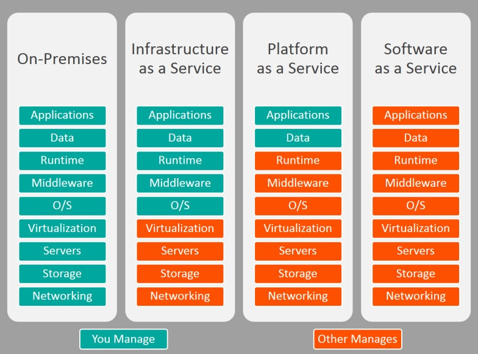
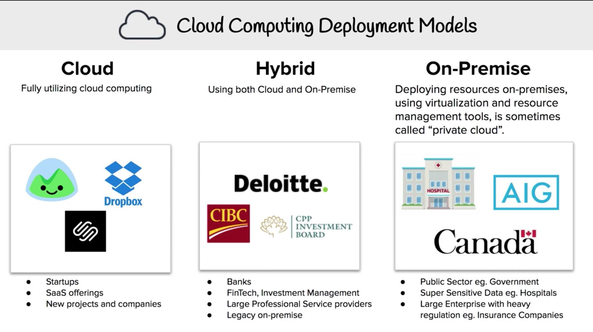

# Cloud Concepts
## 1. What is Cloud Computing
  ### 1.1. Concept
  Điện toán đám mây là việc phân phối các tài nguyên CNTT theo nhu cầu qua Internet với chính sách thanh toán theo mức sử dụng. Thay vì mua, sở hữu và bảo trì các trung tâm dữ liệu và máy chủ vật lý, bạn có thể tiếp cận các dịch vụ công nghệ, như năng lượng điện toán, lưu trữ và cơ sở dữ liệu khi cần thiết
  ### 1.2. On-premise vs Cloud 
  - on-premise:
      + Tự xây dựng cơ sở hạ tầng: hệ thống server, data center, network, security...
      + Cần người quản lý hệ thống
      + Tự quản lý rủi ro về hệ thống
      + Chi phí mở rộng/ Thất bại
  - Cloud:
      + Không cần sở hữu 
      + Không cần người vận hành hệ thống
      + Khả năng mở rộng
## 2. Advantages and Benefits of Cloud Computing

Cloud Scope

- Tiết kiệm chi phí: Thay vì phải bỏ tiền để mua sắm, xây dựng 1 hệ thống vật lý thì chỉ cần thuê và trả tiền theo mức sử dụng. Khi không cần sử dụng có thể tắt để tiết kiệm chi phí. Ngoài ra, với 1 hệ thống vật lý, việc đảm bảo các compliance hay license là tương đối phiền phức. Việc sử dụng Cloud sẽ giúp những vẫn đế này trở nên dễ dàng hơn
- Mô hình linh hoạt: Đối với hệ thống vật lý, cần tính toán tải để có thể đưa ra 1 hệ thống phù hợp cũng như khả nâng cấp tải. Nhưng đối với cloud, bạn chỉ cần lựa chọn cấu hình phù hợp tại thời điểm đó và cấu hình để tự động scale khi tăng tải.
- Triển khai nhanh: Đối với 1 hệ thống vật lý, cần lên thiết kế, mua sắm thiết bị, lắp ráp thiết bị, lựa chọn data center...dẫn đến việc triển khai 1 hệ thống mất rất nhiều thời gian. Nhưng đối với Cloud, chỉ cần lựa chọn Service cần và Start. Hay nói theo 1 chiều hướng khác khách hàng chỉ cần Focus on business value. Thay vì luôn nghĩ về thiết kế hệ thống như thế nào thì người dùng chỉ cần quan tâm đến bussiness của họ từ đó giúp tiết kiệm thời gian cũng như nhân sự.
- Bảo trì: Không cần tốn nhân sự cũng như chi phí để bảo trì 1 hệ thống vật lý. Phía Cloud Provider sẽ thực hiện việc này
- Khả năng Global: Đối với các hệ thống vật lý, để Global cần phải đấu nối hệ thống với 1 ISP(Internet Service Provider). Nhưng đối với Cloud thì chỉ cần 1 vài thao tác đơn giản
## 3. Types of Cloud Computing
- Cơ sở hạ tầng dưới dạng dịch vụ (IaaS): IaaS chứa các khối xây dựng cơ bản cho đám mây CNTT. IaaS thường cung cấp quyền truy cập vào các tính năng mạng, máy tính (ảo hoặc trên phần cứng chuyên dụng) và không gian lưu trữ dữ liệu. IaaS đem đến cho bạn mức độ linh hoạt cũng như khả năng kiểm soát quản lý tài nguyên CNTT cao nhất. IaaS gần giống nhất với các tài nguyên CNTT hiện tại mà nhiều bộ phận CNTT và nhà phát triển hiện nay rất quen thuộc. Ví dụ: AWS, Google Cloud, Microsoft Azure, DigitalOcean
- Nền tảng dưới dạng dịch vụ (PaaS): PaaS giúp bạn không cần quản lý cơ sở hạ tầng ngầm của tổ chức (thường là phần cứng và hệ điều hành) và cho phép bạn tập trung vào công tác triển khai cũng như quản lý các ứng dụng của mình. Điều này giúp bạn làm việc hiệu quả hơn do bạn không cần phải lo lắng về việc thu mua tài nguyên, hoạch định dung lượng, bảo trì phần mềm, vá lỗi hay bất kỳ công việc nặng nhọc nào khác có liên quan đến việc vận hành ứng dụng. Ví dụ: AWS Elastic Beanstalk, Windows Azure, Heroku, Force.com, Google App Engine, Apache Stratos, OpenShift 
- Phần mềm dưới dạng dịch vụ (SaaS): SaaS cung cấp cho bạn sản phẩm hoàn chỉnh được nhà cung cấp dịch vụ vận hành và quản lý. Trong hầu hết các trường hợp, khi nhắc đến SaaS, mọi người thường nghĩ đến ứng dụng dành cho người dùng cuối (chẳng hạn như email trên nền tảng web). Với SaaS, bạn không cần phải nghĩ cách duy trì dịch vụ hoặc cách quản lý cơ sở hạ tầng ngầm. Bạn sẽ chỉ cần nghĩ cách bạn sẽ sử dụng phần mềm cụ thể đó. Ví dụ: Google Apps, Dropbox, Salesforce, Cisco WebEx, Concur, GoToMeeting, Office 365

## 4. Cloud Computing Deployment Models

Việc triển khai các mô hình Cloud Computing hiện nay về cơ bản có thể chia làm 3 hình thức
- Sử dụng các dịch vụ của Cloud Providers:
- Kết hợp
- Tự xây dựng

## 5. Tham khảo
- [AWS Certified Cloud Practitioner Training](https://www.youtube.com/watch?v=3hLmDS179YE&t=11s "AWS Certified Cloud Practitioner Training").
- [What is cloud computing](https://aws.amazon.com/vi/what-is-cloud-computing/ "What is cloud computing").
- [GIẢI NGỐ VỀ CÁC KHÁI NIỆM IAAS, PAAS, SAAS TRONG CLOUD COMPUTING](https://toidicodedao.com/2018/10/23/so-sanh-iaas-paas-saas-la-gi/ "GIẢI NGỐ VỀ CÁC KHÁI NIỆM IAAS, PAAS, SAAS TRONG CLOUD COMPUTING").
- [AWS Certified Cloud Practitioner](https://d1.awsstatic.com/training-and-certification/docs-cloud-practitioner/AWS-Certified-Cloud-Practitioner_Exam-Guide.pdf "(CLF-C01) Exam Guide").

## 6. Keywords
- High Availability
- Reliability
- Elasticity
- Agility
- Pay-as-you go pricing
- Scalability
- Global Reach
- Economy of scale
- Focus on business value
- Reduce compliance scope