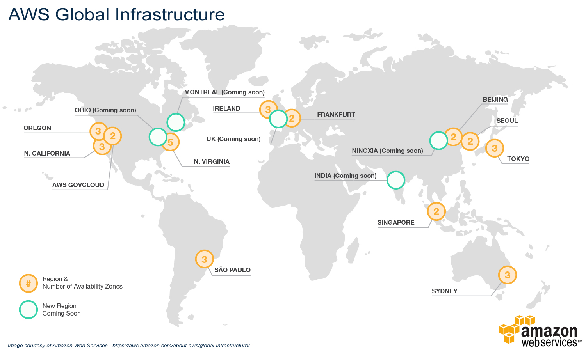
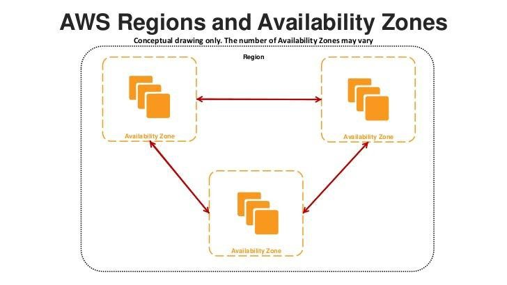

AWS Global Infrastructure
1. Introduction and Map Overview
- Có mặt trên 190 nước
- 69 Availability Zones
- 22 Geographic Regions
- Edge Location: các trusted partner của AWS

2. Regions
- Là khái niệm chỉ về các hệ thống server - Cluster vật lý của AWS: gồm nhiều server vật lý được xậy dựng thành các cụm độc lập nhưng có thể kết nối với nhau nằm ở các khu vực địa lý khác nhau. Ví dụ: Singapore, Japan.....
- Mỗi Region sẽ có tối thiểu 2 Availability Zone
- Region giúp việc Go Global của ứng dụng một cách dễ dàng
- Mỗi Region có các rule chung nhưng cũng sẽ có rule riêng tuy vào vị trí địa lý và cũng có mức phí khác nhau
3. Availability Zones - AZs
- Mỗi AZ sẽ thuộc 1 Region nào đó
- Có tối thiểu 2 AZ trong 1 Region
- Các AZ thuộc 1 Region có thể nằm cách xa nhau, có thể có nhiều hơn 1 Data Center với các Resource độc lập
- Mục đích của các AZ là hạn chế rủi ro lên hệ thống, giúp cho việc available của hệ thống. Ví dụ: khi ứng dụng trên 1 AZ nào đó bị sự cố thì lập tức mọi truy cập sẽ được điều hướng sang các AZ khác
- Giữa các AZ sẽ luôn có sự động bộ với độ trễ thấp
4. Edge Locations
- Là các Data Center được vận hành bởi các đối tác của AWS
- CÓ thể kết nối trực tiếp đến network của AWS
- Phục vụ cho các request tới các dịch vụ như: CloudFront, Route 53
- Nhiệm vụ các Egde:
  + Giảm độ trễ khi request tới các resource của AWS bất kể bạn đang ở đâu cho dù resource không nằm tại vùng địa lý bạn sinh sống
  + Điều hướng Trafic đên AWS. Ví dụ: API Gateway
- Mỗi Region có nhiều Edge
5. GovCloud Regions
- Lưu trữ những thông tin nhạy cảm
- Chỉ phục vụ và access người Mỹ
6. Tham khảo
- [AWS Certified Cloud Practitioner Training](https://www.youtube.com/watch?v=3hLmDS179YE&t=11s "AWS Certified Cloud Practitioner Training").
- [What is cloud computing](https://aws.amazon.com/vi/what-is-cloud-computing/ "What is cloud computing").
- [GIẢI NGỐ VỀ CÁC KHÁI NIỆM IAAS, PAAS, SAAS TRONG CLOUD COMPUTING](https://toidicodedao.com/2018/10/23/so-sanh-iaas-paas-saas-la-gi/ "GIẢI NGỐ VỀ CÁC KHÁI NIỆM IAAS, PAAS, SAAS TRONG CLOUD COMPUTING").
- [AWS Certified Cloud Practitioner](https://d1.awsstatic.com/training-and-certification/docs-cloud-practitioner/AWS-Certified-Cloud-Practitioner_Exam-Guide.pdf "(CLF-C01) Exam Guide").
- [Region Maps and Edge Networks](https://aws.amazon.com/about-aws/global-infrastructure/regions_az/?nc1=h_ls "Region Maps and Edge Networks").